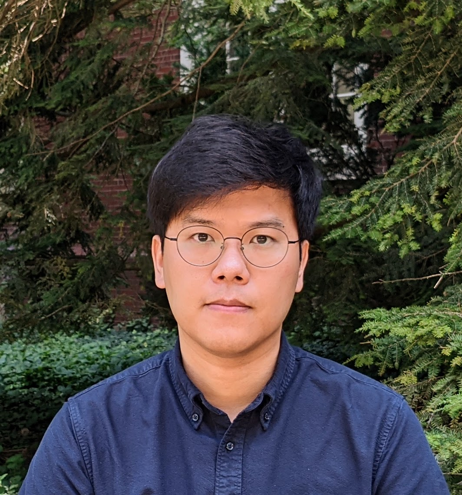

 

              

 
I am a Senior Lecturer and Assistant Director with the Data Analytics and Policy Program at Johns Hopkins University. 
I received my PhD in Political Science at the University of Illinois at Urbana-Champaign in 2022. 
My research interests focus on [authoritarian nostalgia](/research/bookproject/) 
and related political behavior in post-authoritarian democracies. My regional focus is on South Korea and other Asian democracies. My research has appeared in *Party Politics*, *Journal of East Asian Studies*, and *Social Science Quarterly* and is forthcoming at _International Studies Quarterly_ and _International Journal of Press/Politics_.

My research has received support from various sources, including a Faculty Grant Award from the
[SNF Agora Institute](https://snfagora.jhu.edu) at Johns Hopkins University, a
[Taiwan Fellowship](https://taiwanfellowship.ncl.edu.tw/eng/index.aspx) from the Ministry of Foreign Affairs of Taiwan, 
a Doctoral Fellowship from the [Chiang Ching-kuo Foundation for International Scholarly Exchange](http://www.cckf.org/en/), 
and multiple institutions at the University of Illinois. 

